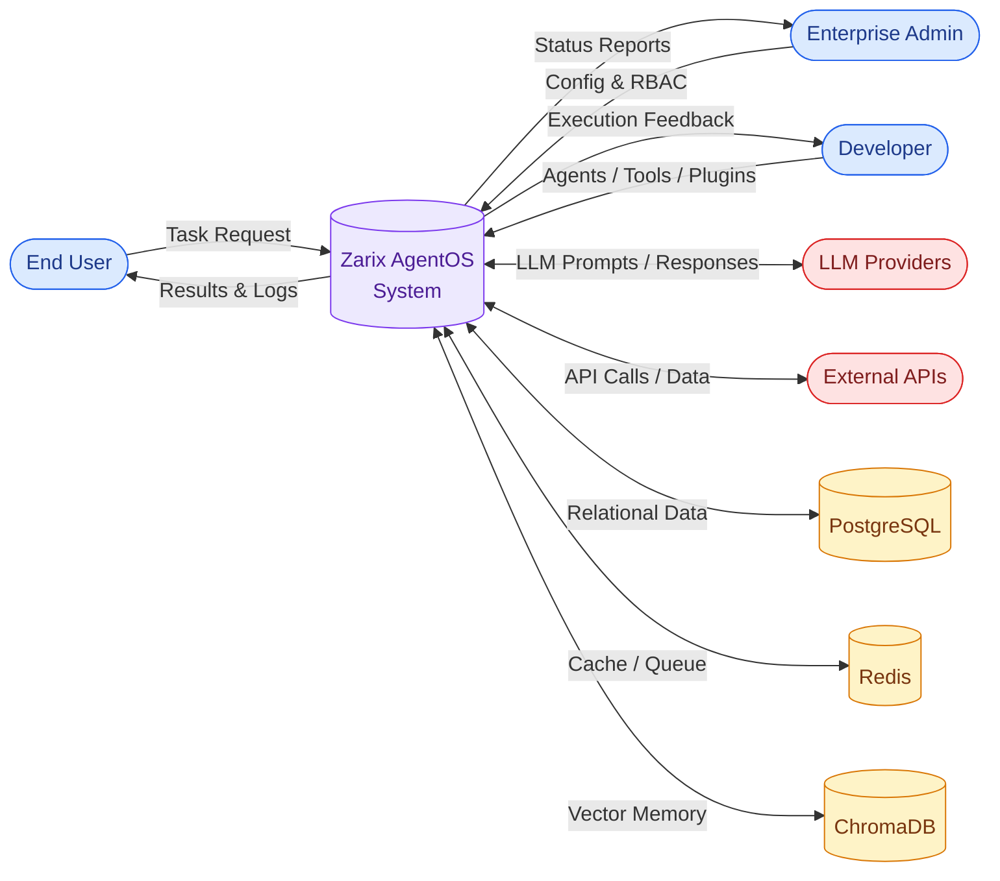
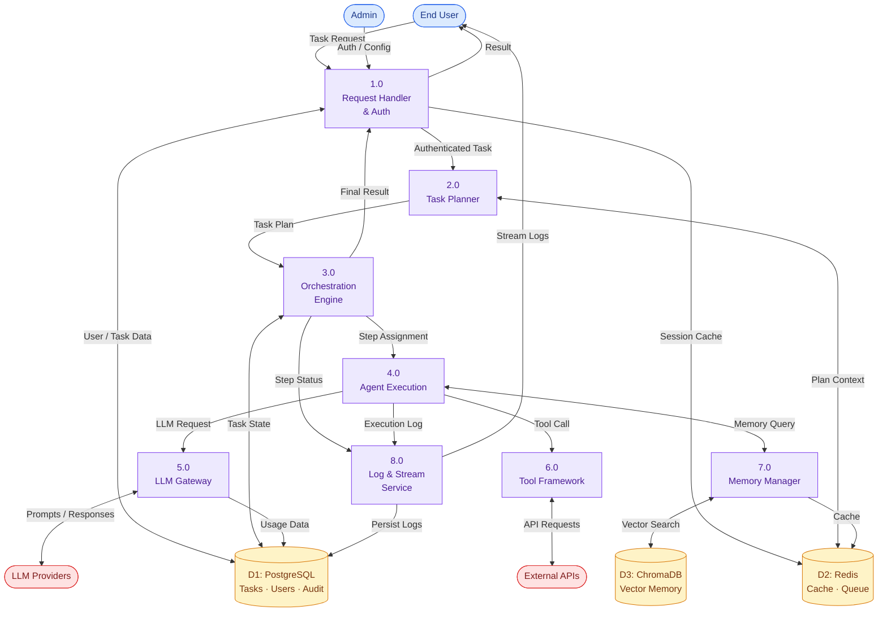

# 6⃣ Data Flow Diagram

### Zarix AgentOS - Data Movement Across System Processes

---

## 1. Overview

A **Data Flow Diagram (DFD)** illustrates how data moves through the Zarix AgentOS platform - from external inputs, through internal processes, to data stores and external outputs. This document includes both **Level 0 (Context Diagram)** and **Level 1 (Detailed Decomposition)**.

---

## 2. DFD Level 0 - Context Diagram

The Level 0 DFD shows the system as a single process with all external entities and data flows.

### Level 0 Data Flows

| From | To | Data Flow |
|------|----|-----------|
| End User | System | Task Request (natural language) |
| System | End User | Results & Execution Logs |
| Enterprise Admin | System | Configuration, RBAC settings |
| System | Enterprise Admin | Status reports, audit logs |
| Developer | System | Custom agents, tools, plugins |
| System | LLM Providers | LLM prompts |
| LLM Providers | System | LLM responses (tokens) |
| System | External APIs | API calls (web, git, cloud) |
| External APIs | System | API responses / data |

---

## 3. DFD Level 1 - Detailed Decomposition

The Level 1 DFD breaks the system into its core processes and shows data flow between them.

---

## 4. Process Descriptions

| Process | Name | Description | Inputs | Outputs |
|---------|------|-------------|--------|---------|
| **1.0** | Request Handler & Auth | Receives requests, authenticates users, enforces RBAC | Task Request, Auth Config | Authenticated Task |
| **2.0** | Task Planner | Decomposes complex requests into ordered sub-tasks | Authenticated Task | Task Plan |
| **3.0** | Orchestration Engine | Coordinates agents, manages step execution order | Task Plan | Step Assignments, Final Result |
| **4.0** | Agent Execution | Executes individual agent logic, calls LLM and tools | Step Assignment | Execution Output, Logs |
| **5.0** | LLM Gateway | Routes LLM requests to providers with fallback | LLM Request | LLM Response |
| **6.0** | Tool Framework | Executes real-world tools (code, web, file, shell) | Tool Call | Tool Output |
| **7.0** | Memory Manager | Stores and retrieves agent memory (short + long term) | Memory Query | Memory Context |
| **8.0** | Log & Stream Service | Streams real-time logs and persists execution history | Step Status, Execution Log | Streamed Logs, Persisted Logs |

---

## 5. Data Store Descriptions

| Store | Name | Technology | Contents |
|-------|------|------------|---------|
| **D1** | Relational Database | PostgreSQL | Users, Tenants, Tasks, Steps, Audit Logs, LLM Calls |
| **D2** | Cache & Queue | Redis | Session state, task queue (Celery broker), hot cache |
| **D3** | Vector Memory | ChromaDB | Agent memory embeddings for semantic recall |

---

## 6. Data Flow Summary Table

| # | Source | Destination | Data | Type |
|---|--------|-------------|------|------|
| 1 | User | P1 (Request Handler) | Task Request | Input |
| 2 | P1 | P2 (Planner) | Authenticated Task | Internal |
| 3 | P2 | P3 (Orchestrator) | Task Plan | Internal |
| 4 | P3 | P4 (Agent Exec) | Step Assignment | Internal |
| 5 | P4 | P5 (LLM Gateway) | LLM Request | Internal |
| 6 | P5 | LLM Providers | Prompts | External |
| 7 | LLM Providers | P5 | Responses | External |
| 8 | P4 | P6 (Tool Framework) | Tool Call | Internal |
| 9 | P6 | External APIs | API Requests | External |
| 10 | P4 | P7 (Memory Mgr) | Memory Query | Internal |
| 11 | P7 | D3 (ChromaDB) | Vector Search | Store I/O |
| 12 | P4 | P8 (Log Service) | Execution Log | Internal |
| 13 | P8 | User | Streamed Logs | Output |
| 14 | P3 | D1 (PostgreSQL) | Task State | Store I/O |
| 15 | P1 | User | Final Result | Output |

---

## 7. Related Documents

| Document | Link |
|----------|------|
| System Analysis & Design | [system-analysis-and-design.md](./system-analysis-and-design.md) |
| System Architecture | [system-architecture.md](./system-architecture.md) |
| Use Case Diagram | [use-case-diagram.md](./use-case-diagram.md) |
| Entity Relationship Diagram | [entity-relationship-diagram.md](./entity-relationship-diagram.md) |
| Sequence Diagram | [sequence-diagram.md](./sequence-diagram.md) |
| Module Diagram | [module-diagram.md](./module-diagram.md) |
| Gantt Chart | [gantt-chart.md](./gantt-chart.md) |

---

**[ Back to Docs Index](./README.md)** · **[ Back to Top](#)**

