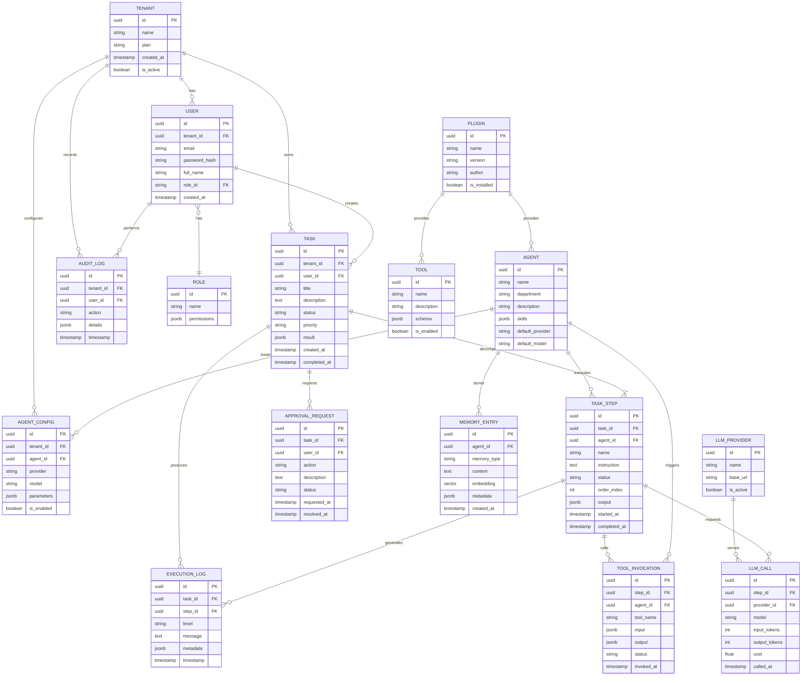

# Entity Relationship Diagram

### Zarix AgentOS - Database Schema & Entity Relationships

---

## 1. Overview

This document defines the **data model** for Zarix AgentOS. The schema is implemented in **PostgreSQL** using SQLAlchemy ORM. It covers multi-tenancy, users, agents, tasks, memory, tools, and audit logging.

---

## 2. Entity Relationship Diagram

---

## 3. Entity Descriptions

### Core Entities

| Entity | Description | Key Attributes |
|--------|-------------|---------------|
| **TENANT** | Isolated organization workspace | id, name, plan, is_active |
| **USER** | Platform user belonging to a tenant | email, password_hash, role_id |
| **ROLE** | RBAC role with permissions | name, permissions (JSONB) |
| **AGENT** | AI agent definition (template) | name, department, skills, default_provider |
| **AGENT_CONFIG** | Per-tenant agent configuration | provider, model, parameters, is_enabled |

### Task Entities

| Entity | Description | Key Attributes |
|--------|-------------|---------------|
| **TASK** | Top-level user request | title, description, status, priority, result |
| **TASK_STEP** | Decomposed sub-task assigned to an agent | instruction, status, order_index, output |
| **EXECUTION_LOG** | Granular log entry for a step | level, message, metadata, timestamp |
| **APPROVAL_REQUEST** | Human-in-the-loop approval | action, status, requested_at |

### Intelligence Entities

| Entity | Description | Key Attributes |
|--------|-------------|---------------|
| **MEMORY_ENTRY** | Agent memory (short/long term) | memory_type, content, embedding (vector) |
| **TOOL_INVOCATION** | Record of a tool call by an agent | tool_name, input, output, status |
| **LLM_PROVIDER** | Registered LLM provider | name, base_url, is_active |
| **LLM_CALL** | Individual LLM API call record | model, input_tokens, output_tokens, cost |

### Extension Entities

| Entity | Description | Key Attributes |
|--------|-------------|---------------|
| **TOOL** | Available tool definition | name, description, schema |
| **PLUGIN** | Installed platform extension | name, version, author, is_installed |
| **AUDIT_LOG** | Security & compliance audit trail | action, details, timestamp |

---

## 4. Relationship Cardinality

| From | To | Relationship | Meaning |
|------|----|--------------|---------|
| TENANT | USER | 1 : N | A tenant has many users |
| TENANT | TASK | 1 : N | A tenant owns many tasks |
| USER | TASK | 1 : N | A user creates many tasks |
| TASK | TASK_STEP | 1 : N | A task decomposes into steps |
| AGENT | TASK_STEP | 1 : N | An agent executes many steps |
| TASK_STEP | EXECUTION_LOG | 1 : N | A step generates many logs |
| TASK_STEP | LLM_CALL | 1 : N | A step makes many LLM calls |
| AGENT | MEMORY_ENTRY | 1 : N | An agent stores many memories |
| PLUGIN | AGENT | 1 : N | A plugin provides many agents |
| PLUGIN | TOOL | 1 : N | A plugin provides many tools |

---

## 5. Indexing Strategy

| Table | Index | Type | Purpose |
|-------|-------|------|---------|
| USER | email | UNIQUE | Login lookup |
| TASK | tenant_id, status | COMPOSITE | Filter tasks by tenant & status |
| TASK_STEP | task_id, order_index | COMPOSITE | Ordered step retrieval |
| EXECUTION_LOG | step_id, timestamp | COMPOSITE | Chronological log access |
| MEMORY_ENTRY | embedding | IVFFLAT | Vector similarity search |
| AUDIT_LOG | tenant_id, timestamp | COMPOSITE | Audit queries by time |

---

## 6. Related Documents

| Document | Link |
|----------|------|
| System Analysis & Design | [system-analysis-and-design.md](./system-analysis-and-design.md) |
| System Architecture | [system-architecture.md](./system-architecture.md) |
| Use Case Diagram | [use-case-diagram.md](./use-case-diagram.md) |
| Sequence Diagram | [sequence-diagram.md](./sequence-diagram.md) |
| Data Flow Diagram | [data-flow-diagram.md](./data-flow-diagram.md) |
| Module Diagram | [module-diagram.md](./module-diagram.md) |
| Gantt Chart | [gantt-chart.md](./gantt-chart.md) |

---

**[ Back to Docs Index](./README.md)** · **[ Back to Top](#)**

