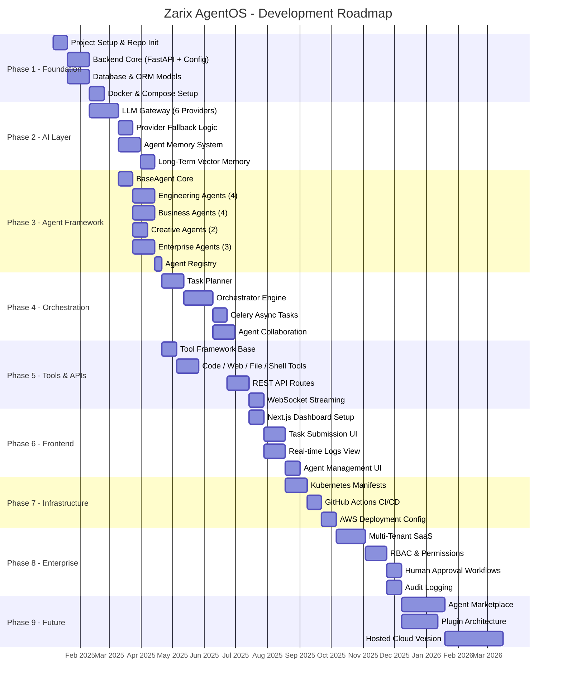
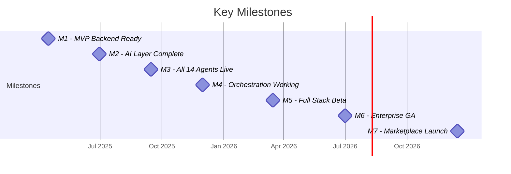

# 8⃣ Gantt Chart

### Zarix AgentOS - Project Roadmap & Development Timeline

---

## 1. Overview

This Gantt Chart visualizes the **development roadmap and project timeline** for Zarix AgentOS. The project is organized into phases spanning from foundation setup through enterprise features and future enhancements.

---

## 2. Project Gantt Chart

---

## 3. Phase Summary

| Phase | Name | Duration | Key Deliverables |
|-------|------|----------|------------------|
| **1** | Foundation | ~10 weeks | Repo, FastAPI core, DB models, Docker |
| **2** | AI Layer | ~11 weeks | LLM Gateway (6 providers), memory system |
| **3** | Agent Framework | ~10 weeks | 14 agents, BaseAgent, registry |
| **4** | Orchestration | ~12 weeks | Planner, orchestrator, Celery, collaboration |
| **5** | Tools & APIs | ~10 weeks | Tool framework, REST + WebSocket APIs |
| **6** | Frontend | ~10 weeks | Dashboard, task UI, real-time logs |
| **7** | Infrastructure | ~7 weeks | Kubernetes, CI/CD, AWS config |
| **8** | Enterprise | ~11 weeks | Multi-tenant, RBAC, approvals, audit |
| **9** | Future | ~19 weeks | Marketplace, plugins, hosted cloud |

---

## 4. Milestones

| Milestone | Target | Description |
|-----------|--------|-------------|
| **M1** | Apr 2025 | MVP backend with FastAPI + DB + Docker |
| **M2** | Jun 2025 | LLM Gateway with all 6 providers + memory |
| **M3** | Sep 2025 | All 14 AI agents registered and functional |
| **M4** | Dec 2025 | Multi-agent orchestration end-to-end |
| **M5** | Mar 2026 | Full-stack beta (frontend + backend + APIs) |
| **M6** | Jul 2026 | Enterprise features (multi-tenant, RBAC) GA |
| **M7** | Dec 2026 | Agent marketplace and plugin ecosystem launch |

---

## 5. Resource Allocation

| Team | Phase Focus | Allocation |
|------|-------------|------------|
| **Backend Engineers** | Phases 1–5, 8 | Core API, AI layer, orchestration |
| **AI/ML Engineers** | Phases 2–4 | LLM gateway, agents, memory, orchestration |
| **Frontend Engineers** | Phase 6 | Dashboard, real-time UI |
| **DevOps Engineers** | Phases 1, 7 | Docker, K8s, CI/CD, cloud |
| **QA Engineers** | Phases 5–8 | Testing across all layers |
| **Product/Design** | Phases 6, 9 | UX, marketplace strategy |

---

## 6. Risk Management

| Risk | Impact | Likelihood | Mitigation |
|------|--------|------------|-----------|
| LLM provider API changes | High | Medium | Abstraction layer + fallback providers |
| Agent orchestration complexity | High | Medium | Incremental delivery, thorough testing |
| Multi-tenant data isolation | Critical | Low | Strict RBAC + tenant-scoped queries |
| Scaling vector memory | Medium | Medium | ChromaDB sharding strategy |
| Frontend real-time performance | Medium | Low | WebSocket optimization, pagination |

---

## 7. Related Documents

| Document | Link |
|----------|------|
| System Analysis & Design | [system-analysis-and-design.md](./system-analysis-and-design.md) |
| System Architecture | [system-architecture.md](./system-architecture.md) |
| Use Case Diagram | [use-case-diagram.md](./use-case-diagram.md) |
| Entity Relationship Diagram | [entity-relationship-diagram.md](./entity-relationship-diagram.md) |
| Sequence Diagram | [sequence-diagram.md](./sequence-diagram.md) |
| Data Flow Diagram | [data-flow-diagram.md](./data-flow-diagram.md) |
| Module Diagram | [module-diagram.md](./module-diagram.md) |

---

**[ Back to Docs Index](./README.md)** · **[ Back to Top](#)**

