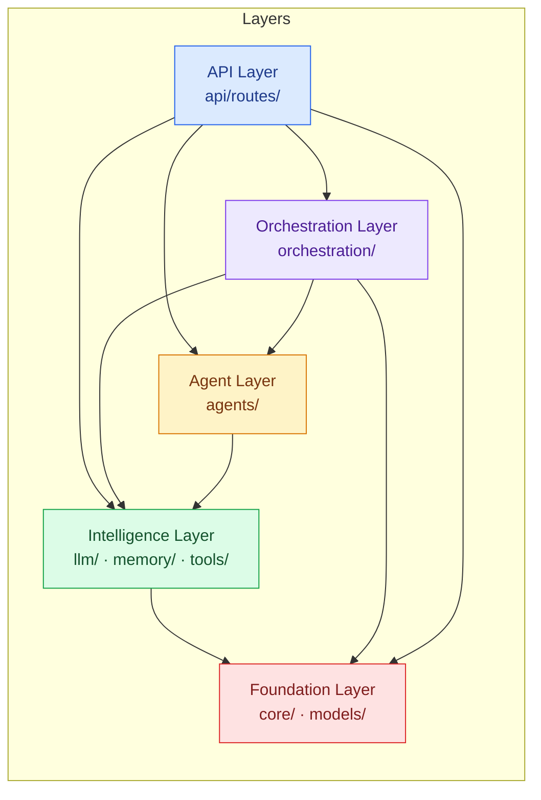

# Module Diagram

### Zarix AgentOS - Code Module Structure & Dependencies

---

## 1. Overview

The Module Diagram represents the **physical organization of the codebase** into modules (packages) and the dependencies between them. Zarix AgentOS follows a **modular monolith** architecture with clear bounded contexts, making it easy to evolve into microservices if needed.

---

## 2. High-Level Module Structure

```mermaid
flowchart TB
  subgraph Frontend[" Frontend Module (Next.js)"]
  FEApp[app/<br/>Pages & Layout]
  FEUI[shadcn/ui Components]
  FEApi[lib/api.ts<br/>API Client + WS]
  end

  subgraph Backend[" Backend Module (FastAPI)"]
  Main[main.py<br/>Entry Point]
  CLI[cli.py<br/>Zarix CLI]

  subgraph Core["core/"]
  Cfg[config.py<br/>Settings]
  DB[database.py<br/>SQLAlchemy]
  Cel[celery_app.py<br/>Task Queue]
  end

  subgraph API["api/routes/"]
  RAgents[agents.py]
  RTasks[tasks.py]
  RLLM[llm.py]
  RTools[tools.py]
  RWS[ws.py<br/>WebSocket]
  end

  subgraph Agents["agents/"]
  ABase[base.py<br/>BaseAgent]
  AEng[engineering.py]
  ABus[business.py]
  ACre[creative.py]
  AEnt[enterprise.py]
  AReg[registry.py]
  end

  subgraph Orchestration["orchestration/"]
  OPlan[planner.py<br/>Task Decomposition]
  OOrch[orchestrator.py<br/>Step Execution]
  OTasks[tasks.py<br/>Celery Tasks]
  end

  subgraph LLM["llm/"]
  LBase[base.py<br/>Provider Interface]
  LGW[gateway.py<br/>Unified Gateway]
  LOpen[openai_provider.py]
  LAnth[anthropic_provider.py]
  LGoogle[google_provider.py]
  LMeta[meta_provider.py]
  LMist[mistral_provider.py]
  LDeep[deepseek_provider.py]
  end

  subgraph Memory["memory/"]
  MShort[short_term.py<br/>Conversation Buffer]
  MLong[long_term.py<br/>ChromaDB Vector]
  MMgr[manager.py<br/>Unified Manager]
  end

  subgraph Tools["tools/"]
  TBase[base.py<br/>BaseTool]
  TCode[code_tool.py]
  TWeb[web_tool.py]
  TFile[file_tool.py]
  TShell[shell_tool.py]
  TReg[registry.py]
  end

  subgraph Models["models/"]
  ModelsPy[models.py<br/>SQLAlchemy ORM]
  end
  end

  subgraph Infra[" Infrastructure"]
  Docker[Dockerfiles]
  K8S[infra/k8s/<br/>Kubernetes]
  Compose[docker-compose.yml]
  end

  %% Dependencies
  FEApi --> RAgents
  FEApi --> RWS
  Main --> API
  Main --> Core
  API --> Orchestration
  API --> Agents
  API --> LLM
  API --> Tools
  OOrch --> AReg
  OOrch --> MMgr
  OOrch --> LGW
  ABase --> LGW
  ABase --> MMgr
  ABase --> TReg
  LGW --> LBase
  MMgr --> MShort
  MMgr --> MLong
  TReg --> TBase
  API --> ModelsPy
  Core --> DB
  DB --> ModelsPy
  OOrch --> Cel

  classDef fe fill:#DBEAFE,stroke:#2563EB,color:#1E3A8A
  classDef be fill:#EDE9FE,stroke:#7C3AED,color:#4C1D95
  classDef core fill:#DCFCE7,stroke:#16A34A,color:#14532D
  classDef infra fill:#FEE2E2,stroke:#DC2626,color:#7F1D1D

  class FEApp,FEUI,FEApi fe
  class Main,CLI,RAgents,RTasks,RLLM,RTools,RWS,ABase,AEng,ABus,ACre,AEnt,AReg,OPlan,OOrch,OTasks,LBase,LGW,LOpen,LAnth,LGoogle,LMeta,LMist,LDeep,MShort,MLong,MMgr,TBase,TCode,TWeb,TFile,TShell,TReg,ModelsPy be
  class Cfg,DB,Cel core
  class Docker,K8S,Compose infra
```

---

## 3. Module Dependency Diagram (Logical)

---

## 4. Module Catalog

### Frontend Modules

| Module | Path | Responsibility |
|--------|------|----------------|
| Pages & Layout | `frontend/app/` | Next.js App Router pages, dashboard UI |
| API Client | `frontend/lib/api.ts` | REST client + WebSocket connection manager |
| Styling | `frontend/app/globals.css` | Tailwind CSS + global styles |

### Backend - Core Modules

| Module | Path | Responsibility |
|--------|------|----------------|
| Entry Point | `backend/app/main.py` | FastAPI app initialization, middleware, routing |
| CLI | `backend/app/cli.py` | `zarix` command-line tool |
| Config | `backend/app/core/config.py` | Environment-based settings (Pydantic) |
| Database | `backend/app/core/database.py` | SQLAlchemy session management |
| Celery | `backend/app/core/celery_app.py` | Async task queue configuration |

### Backend - API Layer

| Module | Path | Responsibility |
|--------|------|----------------|
| Agents API | `backend/app/api/routes/agents.py` | CRUD for agents, list/configure |
| Tasks API | `backend/app/api/routes/tasks.py` | Create, track, retrieve tasks |
| LLM API | `backend/app/api/routes/llm.py` | Direct LLM chat/stream endpoints |
| Tools API | `backend/app/api/routes/tools.py` | List and invoke tools |
| WebSocket | `backend/app/api/routes/ws.py` | Real-time log streaming |

### Backend - Agent Layer

| Module | Path | Responsibility |
|--------|------|----------------|
| Base Agent | `backend/app/agents/base.py` | `BaseAgent` class - lifecycle, memory, tools |
| Engineering | `backend/app/agents/engineering.py` | CTO · Full Stack · DevOps · QA agents |
| Business | `backend/app/agents/business.py` | Analyst · Product · Marketing · Sales agents |
| Creative | `backend/app/agents/creative.py` | UI/UX Designer · Content Creator agents |
| Enterprise | `backend/app/agents/enterprise.py` | ERP · Data Analyst · Cyber Security agents |
| Registry | `backend/app/agents/registry.py` | Agent registration and lookup |

### Backend - Orchestration Layer

| Module | Path | Responsibility |
|--------|------|----------------|
| Planner | `backend/app/orchestration/planner.py` | Task decomposition into steps |
| Orchestrator | `backend/app/orchestration/orchestrator.py` | Step execution + agent collaboration |
| Celery Tasks | `backend/app/orchestration/tasks.py` | Background task definitions |

### Backend - Intelligence Layer

| Module | Path | Responsibility |
|--------|------|----------------|
| LLM Base | `backend/app/llm/base.py` | Provider interface contract |
| LLM Gateway | `backend/app/llm/gateway.py` | Unified gateway + fallback logic |
| OpenAI | `backend/app/llm/openai_provider.py` | OpenAI provider implementation |
| Anthropic | `backend/app/llm/anthropic_provider.py` | Anthropic provider implementation |
| Google | `backend/app/llm/google_provider.py` | Gemini provider implementation |
| Meta | `backend/app/llm/meta_provider.py` | Llama provider implementation |
| Mistral | `backend/app/llm/mistral_provider.py` | Mistral provider implementation |
| DeepSeek | `backend/app/llm/deepseek_provider.py` | DeepSeek provider implementation |
| Short-Term Memory | `backend/app/memory/short_term.py` | Volatile conversation buffer |
| Long-Term Memory | `backend/app/memory/long_term.py` | ChromaDB vector store |
| Memory Manager | `backend/app/memory/manager.py` | Unified memory interface |
| Tool Base | `backend/app/tools/base.py` | `BaseTool` interface |
| Code Tool | `backend/app/tools/code_tool.py` | Python code execution sandbox |
| Web Tool | `backend/app/tools/web_tool.py` | Web search + fetch |
| File Tool | `backend/app/tools/file_tool.py` | File read/write/list |
| Shell Tool | `backend/app/tools/shell_tool.py` | Shell command execution |
| Tool Registry | `backend/app/tools/registry.py` | Tool registration and lookup |

### Backend - Foundation Layer

| Module | Path | Responsibility |
|--------|------|----------------|
| Models | `backend/app/models/models.py` | SQLAlchemy ORM entities |

### Infrastructure Modules

| Module | Path | Responsibility |
|--------|------|----------------|
| Backend Docker | `backend/Dockerfile` | Backend container image |
| Frontend Docker | `frontend/Dockerfile` | Frontend container image |
| Docker Compose | `docker-compose.yml` | Full-stack local orchestration |
| Kubernetes | `infra/k8s/deployment.yaml` | Production K8s manifests |
| CI/CD | `.github/workflows/` | GitHub Actions pipeline |

---

## 5. Dependency Rules

| Rule | Description |
|------|-------------|
|  API → Orchestration | API layer may call orchestration |
|  Orchestration → Agents | Orchestrator assigns work to agents |
|  Agents → Intelligence | Agents use LLM, memory, and tools |
|  Intelligence → Foundation | Intelligence layer depends on core/models |
|  Foundation → API | Foundation must never depend on API |
|  Agents → API | Agents must never call API routes directly |
|  Models → Agents | ORM models must not import agents |

---

## 6. Related Documents

| Document | Link |
|----------|------|
| System Analysis & Design | [system-analysis-and-design.md](./system-analysis-and-design.md) |
| System Architecture | [system-architecture.md](./system-architecture.md) |
| Use Case Diagram | [use-case-diagram.md](./use-case-diagram.md) |
| Entity Relationship Diagram | [entity-relationship-diagram.md](./entity-relationship-diagram.md) |
| Sequence Diagram | [sequence-diagram.md](./sequence-diagram.md) |
| Data Flow Diagram | [data-flow-diagram.md](./data-flow-diagram.md) |
| Gantt Chart | [gantt-chart.md](./gantt-chart.md) |

---

**[ Back to Docs Index](./README.md)** · **[ Back to Top](#)**

