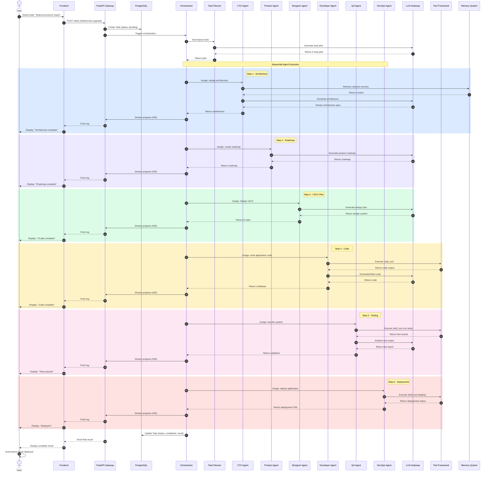
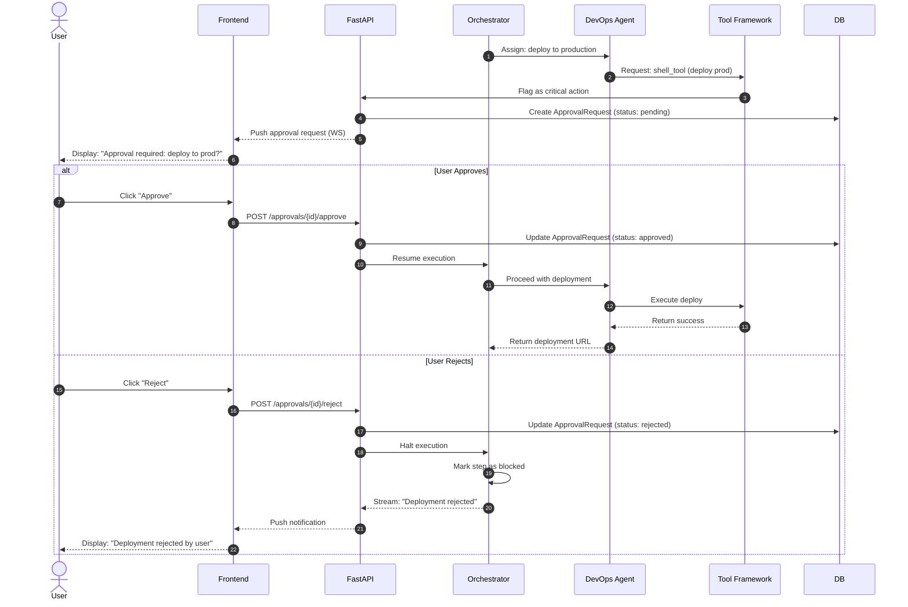
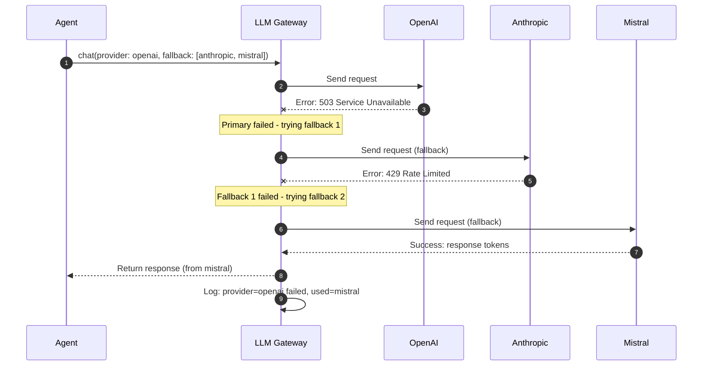

# 5⃣ Sequence Diagram

### Zarix AgentOS - Customer Order / Task Execution Sequence

---

## 1. Overview

This document illustrates the **end-to-end sequence of interactions** when a user submits a task (e.g., *"Build me an ecommerce SaaS platform"*) and the AI workforce collaborates to deliver it. It shows the temporal ordering of messages between all participating components.

---

## 2. Primary Scenario - Full Task Execution

---

## 3. Alternative Scenario - Human Approval Required

When an agent attempts a **critical action** (e.g., production deployment, destructive operation), the system pauses for human approval.

---

## 4. Alternative Scenario - LLM Provider Fallback

When the primary LLM provider fails, the gateway automatically falls back to alternate providers.

---

## 5. Message Flow Summary

| Step | From | To | Message | Purpose |
|------|------|----|---------|---------|
| 1 | User | Frontend | Submit task | Initiate workflow |
| 2 | Frontend | API | POST /tasks | Create task record |
| 3 | API | Orchestrator | Trigger | Begin orchestration |
| 4 | Orchestrator | Planner | Decompose | Break into steps |
| 5-10 | Orchestrator | Agents | Assign steps | Sequential execution |
| 11 | Agents | LLM Gateway | Generate | AI inference |
| 12 | Agents | Tools | Execute | Real-world actions |
| 13 | Agents | Memory | Store/Retrieve | Context persistence |
| 14 | Orchestrator | API | Stream logs | Real-time updates |
| 15 | API | Frontend | Push (WS) | Live dashboard |
| 16 | Orchestrator | DB | Update task | Persist final result |

---

## 6. Sequence Design Notes

| Concern | Handling |
|---------|----------|
| **Concurrency** | Steps execute sequentially by default; parallel execution supported for independent steps |
| **Failure** | Failed steps trigger retry with exponential backoff; persistent failures halt the task |
| **Timeouts** | Each LLM call has a configurable timeout; tool executions are sandboxed |
| **Idempotency** | Task IDs are UUIDs; re-submission creates new tasks |
| **Streaming** | WebSocket channels stream token-by-token output for live UX |

---

## 7. Related Documents

| Document | Link |
|----------|------|
| System Analysis & Design | [system-analysis-and-design.md](./system-analysis-and-design.md) |
| System Architecture | [system-architecture.md](./system-architecture.md) |
| Use Case Diagram | [use-case-diagram.md](./use-case-diagram.md) |
| Entity Relationship Diagram | [entity-relationship-diagram.md](./entity-relationship-diagram.md) |
| Data Flow Diagram | [data-flow-diagram.md](./data-flow-diagram.md) |
| Module Diagram | [module-diagram.md](./module-diagram.md) |
| Gantt Chart | [gantt-chart.md](./gantt-chart.md) |

---

**[ Back to Docs Index](./README.md)** · **[ Back to Top](#)**

