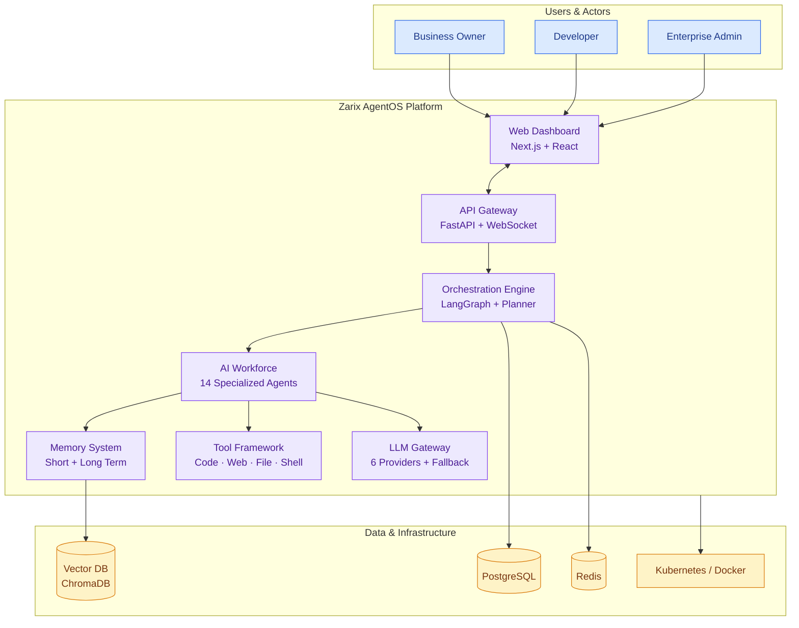
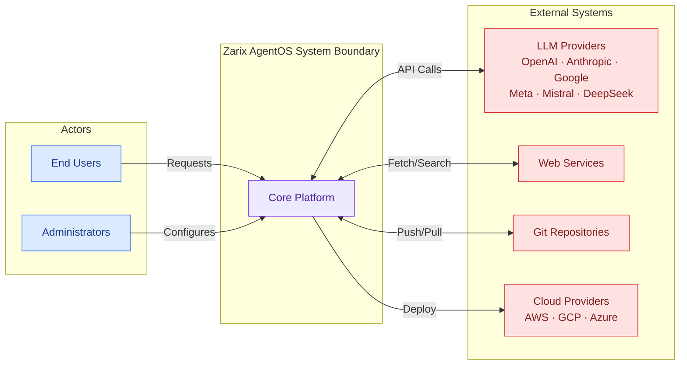
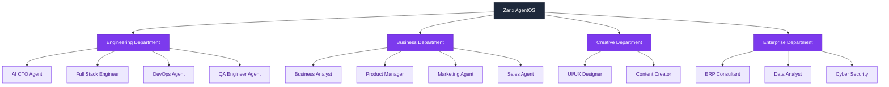

# 1⃣ System Analysis & Design

### Zarix AgentOS - Autonomous AI Workforce Operating System

---

## 1. Executive Summary

**Zarix AgentOS** is an open-source Agentic AI platform that provides a complete AI workforce capable of handling software development, business operations, automation, analysis, and enterprise tasks. The system replaces traditional agency workflows by deploying specialized AI employees that collaborate end-to-end.

This document presents the **system analysis and design** - covering the problem domain, stakeholder needs, functional/non-functional requirements, and the design methodology that governs the architecture.

---

## 2. Problem Statement

Modern enterprises rely on large, expensive teams of specialists (CTOs, product managers, designers, developers, QA engineers, DevOps, analysts) to build and operate digital products. This model is:

- **Slow** - human handoffs create bottlenecks
- **Expensive** - full teams cost tens of thousands per month
- **Inconsistent** - quality varies by individual
- **Hard to scale** - hiring and onboarding takes weeks

### The Zarix Solution

A multi-agent AI operating system where every agent behaves like an expert employee - with memory, skills, tools, and collaboration ability - orchestrated to deliver complete workflows autonomously.

---

## 3. Stakeholder Analysis

| Stakeholder | Role | Interest |
|-------------|------|----------|
| **Business Owners** | Decision makers | Reduce costs, accelerate delivery |
| **Product Teams** | Planners | Faster roadmaps, feature execution |
| **Developers** | Builders | Automate repetitive coding tasks |
| **DevOps Engineers** | Operators | Reliable deployment pipelines |
| **QA Engineers** | Quality assurance | Automated testing & validation |
| **Enterprise IT** | Governance | Security, compliance, RBAC |
| **Open-source Community** | Contributors | Extensible, transparent platform |

---

## 4. System Overview

---

## 5. Functional Requirements

| ID | Requirement | Priority |
|----|-------------|----------|
| FR-01 | The system shall accept natural-language task requests from users |  High |
| FR-02 | The system shall decompose complex requests into executable sub-tasks |  High |
| FR-03 | The system shall orchestrate multiple specialized AI agents to execute tasks |  High |
| FR-04 | The system shall provide a unified LLM gateway supporting 6+ providers |  High |
| FR-05 | The system shall maintain short-term and long-term agent memory |  High |
| FR-06 | The system shall allow agents to invoke external tools (code, web, file, shell) |  High |
| FR-07 | The system shall support human-in-the-loop approval workflows |  Medium |
| FR-08 | The system shall stream real-time execution logs to the dashboard |  Medium |
| FR-09 | The system shall support multi-tenant workspaces with RBAC |  Medium |
| FR-10 | The system shall provide an agent marketplace for pre-built agents |  Low |
| FR-11 | The system shall support a plugin architecture for extensibility |  Low |

---

## 6. Non-Functional Requirements

| ID | Category | Requirement |
|----|----------|-------------|
| NFR-01 | **Performance** | API response time < 200ms (excluding LLM calls) |
| NFR-02 | **Scalability** | Horizontally scalable via Kubernetes; supports 1000+ concurrent tenants |
| NFR-03 | **Availability** | 99.9% uptime with provider fallback for LLM calls |
| NFR-04 | **Security** | RBAC, tenant isolation, encrypted secrets, audit logging |
| NFR-05 | **Extensibility** | New agents/tools added without core changes (plugin pattern) |
| NFR-06 | **Observability** | Full execution trace for every agent action |
| NFR-07 | **Portability** | Containerized; deployable on any cloud or on-prem |
| NFR-08 | **Maintainability** | Modular codebase with clear separation of concerns |

---

## 7. Design Methodology

Zarix AgentOS follows a **layered, agent-oriented architecture** combining elements of:

| Methodology | Application |
|-------------|-------------|
| **Domain-Driven Design** | Bounded contexts: Agents, Orchestration, Memory, Tools, LLM |
| **Event-Driven Architecture** | WebSocket streaming, Celery async tasks |
| **Microservices-ready** | Modular monolith deployable as distributed services |
| **Agent-Oriented Design** | Autonomous agents with memory, goals, and tools |
| **Hexagonal Architecture** | Core logic isolated from external interfaces (LLM, DB, APIs) |

---

## 8. System Boundaries

---

## 9. Agent Workforce Overview

The system's AI workforce is organized into four departments:

---

## 10. Assumptions & Constraints

### Assumptions
- Users have access to at least one LLM provider API key
- Docker and Kubernetes are available for production deployment
- Network connectivity exists between the platform and LLM providers

### Constraints
- LLM token costs scale with usage (cost constraint)
- LLM providers have rate limits and latency variability
- Open-source license (MIT) governs distribution

---

## 11. Related Documents

| Document | Link |
|----------|------|
| System Architecture | [system-architecture.md](./system-architecture.md) |
| Use Case Diagram | [use-case-diagram.md](./use-case-diagram.md) |
| Entity Relationship Diagram | [entity-relationship-diagram.md](./entity-relationship-diagram.md) |
| Sequence Diagram | [sequence-diagram.md](./sequence-diagram.md) |
| Data Flow Diagram | [data-flow-diagram.md](./data-flow-diagram.md) |
| Module Diagram | [module-diagram.md](./module-diagram.md) |
| Gantt Chart | [gantt-chart.md](./gantt-chart.md) |

---

**[ Back to Docs Index](./README.md)** · **[ Back to Top](#)**

