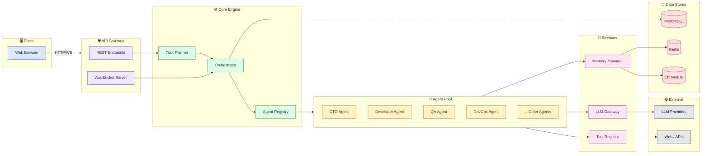
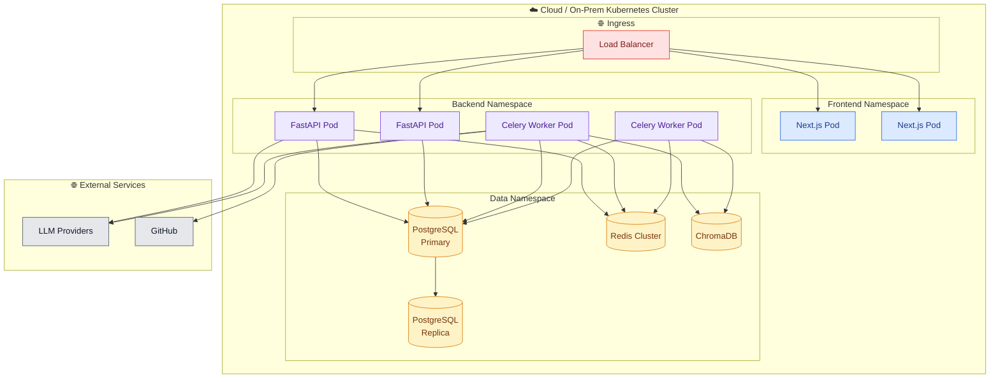
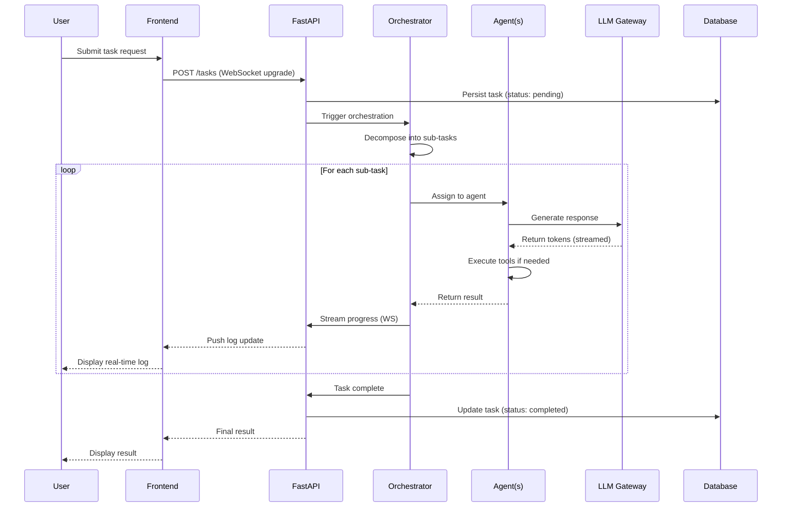

# 2️⃣ System Architecture

### Zarix AgentOS — Layered Cloud-Native Architecture

---

## 1. Architecture Overview

Zarix AgentOS follows a **layered architecture** with clear separation of concerns. Each layer has a distinct responsibility and communicates only with adjacent layers through well-defined interfaces.

```mermaid
flowchart TB
    subgraph L1["🎨 Presentation Layer"]
        FE[Web Dashboard<br/>Next.js 15 + React]
        RT[Real-time Logs<br/>WebSocket Stream]
        UI[shadcn/ui Components]
    end

    subgraph L2["⚡ API & Orchestration Layer"]
        API[FastAPI REST Gateway]
        WS[WebSocket Server]
        AUTH[Auth & RBAC Engine]
        ORCH[Orchestration Engine<br/>LangGraph + Planner]
        CEL[Celery Task Queue]
    end

    subgraph L3["🤖 Agent & Intelligence Layer"]
        REG[Agent Registry<br/>14 Agents]
        BASE[BaseAgent Core]
        MEM[Memory System<br/>Short + Long Term]
        TOOLS[Tool Framework<br/>Code · Web · File · Shell]
        LLMG[LLM Gateway<br/>6 Providers + Fallback]
    end

    subgraph L4["💾 Data & Persistence Layer"]
        PG[(PostgreSQL<br/>Relational Data)]
        RD[(Redis<br/>Cache + Queue)]
        VDB[(ChromaDB<br/>Vector Memory)]
    end

    subgraph L5["☁️ Infrastructure Layer"]
        DK[Docker Containers]
        K8S[Kubernetes Orchestration]
        CI[GitHub Actions CI/CD]
        AWS[Cloud Deployment]
    end

    L1 --> L2
    L2 --> L3
    L3 --> L4
    L4 --> L5

    classDef l1 fill:#DBEAFE,stroke:#2563EB,color:#1E3A8A
    classDef l2 fill:#EDE9FE,stroke:#7C3AED,color:#4C1D95
    classDef l3 fill:#DCFCE7,stroke:#16A34A,color:#14532D
    classDef l4 fill:#FEF3C7,stroke:#D97706,color:#78350F
    classDef l5 fill:#FEE2E2,stroke:#DC2626,color:#7F1D1D

    class FE,RT,UI l1
    class API,WS,AUTH,ORCH,CEL l2
    class REG,BASE,MEM,TOOLS,LLMG l3
    class PG,RD,VDB l4
    class DK,K8S,CI,AWS l5
```

---

## 2. Component Diagram

---

## 3. Deployment Topology

---

## 4. Layer Responsibilities

### Layer 1 — Presentation
| Component | Responsibility |
|-----------|---------------|
| Web Dashboard | User interface for task submission, monitoring, and configuration |
| Real-time Logs | Live streaming of agent execution via WebSocket |
| UI Components | Reusable shadcn/ui component library |

### Layer 2 — API & Orchestration
| Component | Responsibility |
|-----------|---------------|
| REST Gateway | HTTP endpoints for agents, tasks, tools, LLM |
| WebSocket Server | Real-time bidirectional communication |
| Auth & RBAC | Authentication, authorization, tenant isolation |
| Orchestration Engine | Multi-agent coordination via LangGraph |
| Celery Queue | Asynchronous background task execution |

### Layer 3 — Agent & Intelligence
| Component | Responsibility |
|-----------|---------------|
| Agent Registry | Catalog of 14 specialized AI agents |
| BaseAgent Core | Shared agent lifecycle, memory, tool access |
| Memory System | Short-term context + long-term vector recall |
| Tool Framework | Code execution, web search, file ops, shell |
| LLM Gateway | Unified interface to 6 LLM providers with fallback |

### Layer 4 — Data & Persistence
| Component | Responsibility |
|-----------|---------------|
| PostgreSQL | Users, tenants, tasks, agents, audit logs |
| Redis | Caching, session state, Celery broker |
| ChromaDB | Vector embeddings for long-term agent memory |

### Layer 5 — Infrastructure
| Component | Responsibility |
|-----------|---------------|
| Docker | Containerization of all services |
| Kubernetes | Orchestration, scaling, self-healing |
| GitHub Actions | CI/CD pipeline |
| Cloud | AWS / GCP / Azure deployment |

---

## 5. Request Flow

---

## 6. Architectural Decisions

| Decision | Choice | Rationale |
|----------|--------|-----------|
| Backend framework | FastAPI | Async, high-performance, auto-docs (OpenAPI) |
| Frontend framework | Next.js 15 | SSR, React ecosystem, fast DX |
| Agent orchestration | LangGraph | Stateful multi-agent graphs |
| Task queue | Celery + Redis | Battle-tested async task processing |
| Vector DB | ChromaDB | Open-source, embedded, easy integration |
| Relational DB | PostgreSQL | Robust, scalable, JSON support |
| Containerization | Docker + Kubernetes | Portable, scalable, self-healing |
| LLM abstraction | Custom Gateway | Provider-agnostic with fallback |

---

## 7. Related Documents

| Document | Link |
|----------|------|
| System Analysis & Design | [system-analysis-and-design.md](./system-analysis-and-design.md) |
| Use Case Diagram | [use-case-diagram.md](./use-case-diagram.md) |
| Entity Relationship Diagram | [entity-relationship-diagram.md](./entity-relationship-diagram.md) |
| Sequence Diagram | [sequence-diagram.md](./sequence-diagram.md) |
| Data Flow Diagram | [data-flow-diagram.md](./data-flow-diagram.md) |
| Module Diagram | [module-diagram.md](./module-diagram.md) |
| Gantt Chart | [gantt-chart.md](./gantt-chart.md) |

---

**[⬅ Back to Docs Index](./README.md)** · **[⬆ Back to Top](#)**

