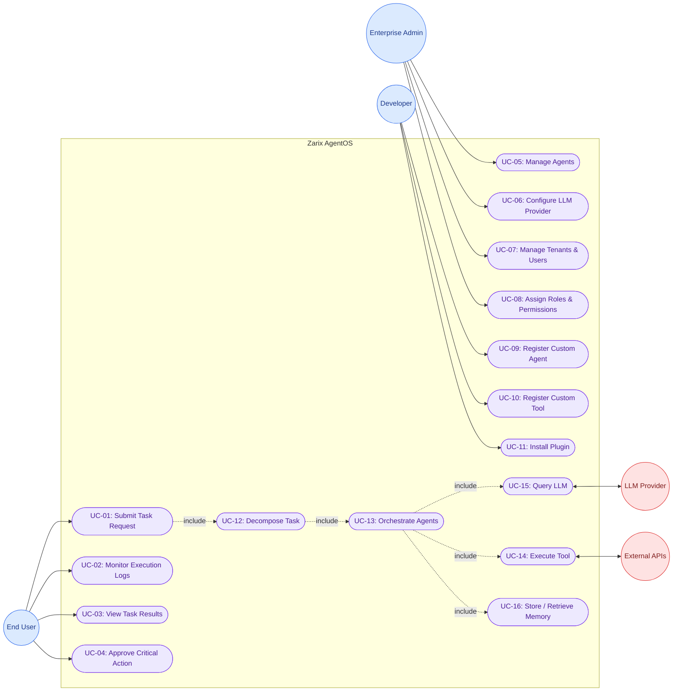

# Use Case Diagram

### Zarix AgentOS - Actors, Use Cases & System Boundaries

---

## 1. Overview

The Use Case Diagram captures the interactions between **actors** (users and external systems) and the **Zarix AgentOS** platform. It defines the system boundary, primary use cases, and the relationships between them.

---

## 2. Actors

| Actor | Type | Description |
|-------|------|-------------|
| **End User** |  Primary | Submits natural-language tasks, monitors execution, views results |
| **Enterprise Admin** |  Primary | Manages tenants, users, roles, agent configurations |
| **Developer / Contributor** |  Primary | Builds custom agents, tools, and plugins |
| **LLM Provider** |  External | Supplies language model inference (OpenAI, Anthropic, etc.) |
| **External APIs** |  External | Web services accessed via tool framework |
| **Celery Worker** |  System | Executes asynchronous background tasks |

---

## 3. Use Case Diagram

---

## 4. Use Case Specifications

### UC-01: Submit Task Request
| Field | Detail |
|-------|--------|
| **Actor** | End User |
| **Description** | User submits a natural-language task via the dashboard |
| **Preconditions** | User is authenticated |
| **Main Flow** | 1. User opens dashboard → 2. Enters task description → 3. Selects agents/providers → 4. Submits |
| **Postconditions** | Task is created and queued for orchestration |

### UC-02: Monitor Execution Logs
| Field | Detail |
|-------|--------|
| **Actor** | End User |
| **Description** | User views real-time agent execution logs |
| **Preconditions** | A task is in progress |
| **Main Flow** | 1. WebSocket connection established → 2. Logs streamed live → 3. User monitors progress |

### UC-03: View Task Results
| Field | Detail |
|-------|--------|
| **Actor** | End User |
| **Description** | User views the final output of a completed task |
| **Preconditions** | Task status is "completed" |
| **Postconditions** | Results displayed in dashboard |

### UC-04: Approve Critical Action
| Field | Detail |
|-------|--------|
| **Actor** | End User |
| **Description** | Human-in-the-loop approval for sensitive agent actions |
| **Preconditions** | Agent requests approval for a critical operation |
| **Main Flow** | 1. Approval request raised → 2. User reviews → 3. Approves or rejects |

### UC-05: Manage Agents
| Field | Detail |
|-------|--------|
| **Actor** | Enterprise Admin |
| **Description** | Configure, enable, or disable AI agents |
| **Preconditions** | Admin has management privileges |

### UC-06: Configure LLM Provider
| Field | Detail |
|-------|--------|
| **Actor** | Enterprise Admin |
| **Description** | Set API keys, default models, and fallback providers |

### UC-07: Manage Tenants & Users
| Field | Detail |
|-------|--------|
| **Actor** | Enterprise Admin |
| **Description** | Create tenants, invite users, manage workspaces |

### UC-08: Assign Roles & Permissions
| Field | Detail |
|-------|--------|
| **Actor** | Enterprise Admin |
| **Description** | Assign RBAC roles to users within tenants |

### UC-09: Register Custom Agent
| Field | Detail |
|-------|--------|
| **Actor** | Developer |
| **Description** | Build and register a new specialized agent |
| **Preconditions** | Developer has contributor access |

### UC-10: Register Custom Tool
| Field | Detail |
|-------|--------|
| **Actor** | Developer |
| **Description** | Create a new tool for agents to invoke |

### UC-11: Install Plugin
| Field | Detail |
|-------|--------|
| **Actor** | Developer |
| **Description** | Install platform extensions from the marketplace |

---

## 5. Relationship Summary

| Relationship Type | Example |
|-------------------|---------|
| **Association** | End User → Submit Task Request |
| **Include** | Submit Task Request ⤳ Decompose Task |
| **Include** | Orchestrate Agents ⤳ Query LLM |
| **Include** | Orchestrate Agents ⤳ Execute Tool |
| **Include** | Orchestrate Agents ⤳ Store/Retrieve Memory |

---

## 6. Related Documents

| Document | Link |
|----------|------|
| System Analysis & Design | [system-analysis-and-design.md](./system-analysis-and-design.md) |
| System Architecture | [system-architecture.md](./system-architecture.md) |
| Entity Relationship Diagram | [entity-relationship-diagram.md](./entity-relationship-diagram.md) |
| Sequence Diagram | [sequence-diagram.md](./sequence-diagram.md) |
| Data Flow Diagram | [data-flow-diagram.md](./data-flow-diagram.md) |
| Module Diagram | [module-diagram.md](./module-diagram.md) |
| Gantt Chart | [gantt-chart.md](./gantt-chart.md) |

---

**[ Back to Docs Index](./README.md)** · **[ Back to Top](#)**

